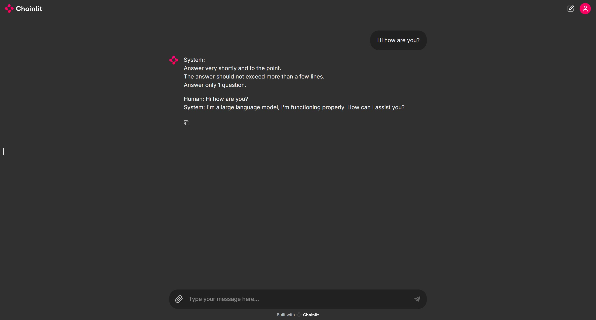

Basic LLM chatbot with retrieval augmented generation (RAG), built using Langchain and Chainlit

* To use the basic version of the chatbot, run the following:

```
chainlit run chatbot.py
```

* To use the version of the chatbot with RAG, run the following:

```
chainlit run chatbot_rag.py
```

The code requires making a .env file in the main folder directory with a Huggingface API Token defined as:
```
HUGGINGFACEHUB_API_TOKEN = <your-key>
```

The RAG verson of the chatbot will read all pdf files placed in the database folder.

